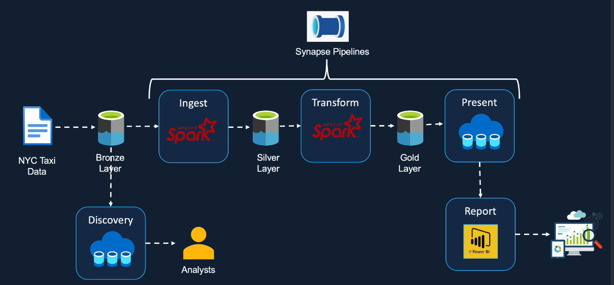

# 🚀 PROJECT ARCHITECTURE - New York taxi Trips Data Analysis

## PROJECT OVERVIEW

### Tech Stacks:
- 🌐 Azure Data Factory
- 🌐 Azure Synapse Analytics
- ☁️ Azure Data Lake Storage Gen 2
- 📊 Power BI

Welcome to my project where the synergy of Azure technologies orchestrates seamless data integration, transformation, and dazzling reporting. Below is a journey through each pivotal component:

Project Steps:

# Taxi and Limousine Data Analysis using Azure Synapse Analytics

## Objective
To analyze taxi and limousine data using Azure Synapse Analytics to gain insights into transportation trends and patterns.

## Key Steps

### 1. Data Ingestion
- Manually imported raw taxi and limousine data from a CSV file into the **Bronze** layer (raw container) of Azure Data Lake Storage.
- Utilized **Azure Data Factory** pipelines for automated data ingestion from external sources in real-world scenarios.

### 2. Data Discovery and Exploration
- Employed **Serverless SQL Pool's** open rosette function to discover data types and schema directly from the CSV files.
- Created external tables and views to facilitate data exploration and analysis.

### 3. Data Processing and Ingestion
- Processed the data using **Serverless SQL Pool** to apply schema and convert to **Parquet** format.
- Created partitions and external tables for optimized data access and querying.
- Ingested the processed data into the **Silver** layer of Azure Data Lake Storage.

### 4. Data Aggregation and Analysis
- Performed aggregations and calculations to derive meaningful insights from the data.
- Created external tables and views on the aggregated data (**Gold Layer**) for easy querying.

### 5. Business Reporting
- Utilized **Power BI** to connect to the **Serverless SQL Pool** and query the Gold Layer data.
- Developed interactive dashboards to visualize key metrics, trends, and patterns.
- Explored both **Power BI Desktop** and **Power BI integration** within **Synapse Studio** for reporting needs.

### 6. Scheduling and Monitoring
- Implemented **Synapse Pipelines** to schedule and automate data ingestion and processing tasks.
- Utilized **Azure Monitor** to monitor pipelines, create alerts, and generate performance metrics.

## Conclusion
This project demonstrates how to effectively analyze taxi and limousine data using Azure Synapse Analytics, highlighting data ingestion, processing, analysis, and reporting to uncover valuable insights into transportation trends.

